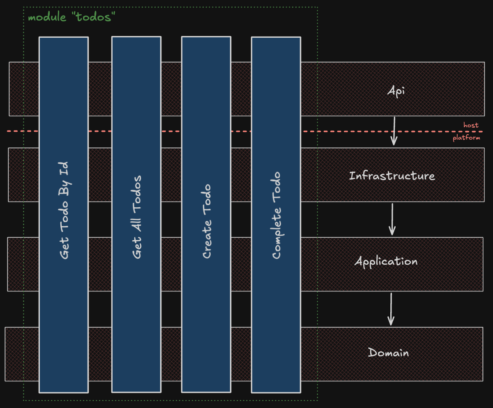

# Feature Sliced Clean Architecture

A clean architecture-based Todo application with vertically sliced features with minimal added dependencies.



## Project Structure

.sln
```
TodoApp/
├── host/
│   └── TodoApp.API                      # REST API endpoints and configuration (Minimal APIs and Swagger)
├── platform/
│   ├── TodoApp.Application              # Application business logic and CQRS handlers (Result and CQRS)
│   ├── TodoApp.Domain                   # Domain entities and business rules
│   └── TodoApp.Infrastructure           # Data access and external services implementation (EF Core In-memory and Repository)
└── tests/
    ├── TodoApp.API.IntegrationTests
    ├── TodoApp.Application.UnitTests
    └── TodoApp.Domain.UnitTests
```

## Features

- Create, read, update, and complete todo items
- Validation for todo items (title length, description length)
- Swagger/OpenAPI documentation
- In-memory database
- Integration and unit tests

## Prerequisites

- [.NET 8 SDK](https://dotnet.microsoft.com/en-us/download/dotnet/8.0)
- An IDE or editor (Visual Studio, Rider, or VS Code)

## Getting Started (CLI)

1. Clone the repository and navigate to project root
2. Build project `dotnet build`
3. Run project `dotnet run --project TodoApp.API`
4. Test project `dotnet test` (optional)

## Getting Started (IDE)

1. Clone the repository and navigate to project root
2. Open solution `TodoApp.sln`
3. Build and run from IDE interface
